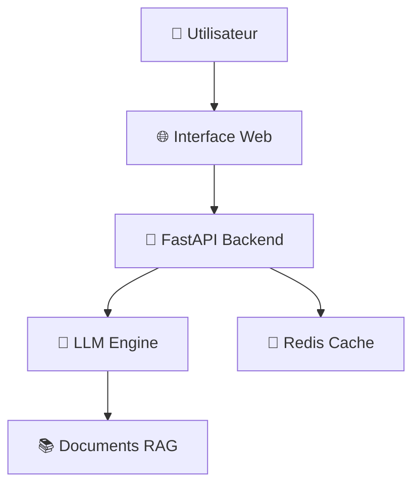

# 🏗️ Archibot-light

<div align="center">
  
  
  **Assistant IA spécialisé en architecture et urbanisme**
  
  [](https://railway.app/template/archibot-light)
  
  
</div>

---

## 🚀 **Démarrage ultra-rapide** *(2 minutes chrono)*

### 1️⃣ **Cliquez** ➡️ [](https://railway.app/template/archibot-light)

### 2️⃣ **Connect GitHub**
- "Deploy from GitHub repo" 
- Connectez GitHub
- Fork ce repo

### 3️⃣ **Settings obligatoires**

**📁 Root Directory :** `/` (racine du repo)

**⚙️ Build Command :** *(la construction utilise le `Dockerfile`)*

**🚀 Start Command :** *(défini dans le `Dockerfile`)*

### 4️⃣ **Variables (Settings > Variables)**

| Variable | Valeur |
|----------|--------|
| `OPENAI_API_KEY` | `sk-xxx...` |
| `GROQ_API_KEY` | `gsk_xxx...` (optionnel) |

### 5️⃣ **Deploy & Test**
- "Redeploy" 
- Attendez le build (2-3 min)
- URL auto-générée : `https://your-app.railway.app`

### 4️⃣ **Exemples de questions**
<div style="background: #f8f9fa; padding: 15px; border-radius: 8px; margin: 10px 0;">

💡 **"Quelle hauteur maximale en zone urbaine ?"**  
🏠 **"Comment calculer un coefficient d'occupation des sols ?"**  
📋 **"Règles PLU pour une extension de maison ?"**  
🏗️ **"Distance minimale entre deux bâtiments ?"**

</div>

---

## 🎯 **C'est quoi Archibot ?**

<table>
<tr>
<td width="50%">

### ✨ **Pour qui ?**
- 👨‍💼 **Architectes** 
- 🏙️ **Urbanistes**
- 🎓 **Étudiants**
- 🏢 **Bureaux d'études**

</td>
<td width="50%">

### 🔥 **Pourquoi ?**
- ⚡ **Réponses instantanées**
- 📚 **Connaissance réglementaire**
- 🎯 **Spécialisé architecture**
- 🆓 **Gratuit et open-source**

</td>
</tr>
</table>

---

## 🎨 **Aperçu de l'interface**

<div align="center">
  
  <p><em>Interface simple et intuitive pour poser vos questions</em></p>
</div>

---

<details>
<summary><h2>🔧 **Documentation technique** <em>(cliquez pour développer)</em></h2></summary>

## ⚙️ **Architecture technique**



## 📋 **Prérequis**

- **Python 3.8+**
- **Redis** (pour le cache)
- **Clé API** (OpenAI, Groq, ou Together)

## 🛠️ **Installation locale**

```bash
# 1. Cloner le projet
git clone https://github.com/URA-BOT1/Archibot-light.git
cd archibot-light

# 2. Installer les dépendances
python -m pip install --no-cache-dir -r requirements.txt

# 3. Variables d'environnement
export OPENAI_API_KEY="votre-cle-api"
export GROQ_API_KEY="votre-cle-groq"

# 4. Lancer le serveur
uvicorn backend.main:app --reload
```

## 🌐 **Configuration Railway**

### Variables d'environnement

| Variable | Description | Requis | Exemple |
|----------|-------------|---------|---------|
| `PORT` | Port du serveur | ❌ | `8000` |
| `OPENAI_API_KEY` | Clé API OpenAI | ✅ | `sk-...` |
| `GROQ_API_KEY` | Clé API Groq | ⚠️ | `gsk_...` |
| `TOGETHER_API_KEY` | Clé API Together | ⚠️ | `...` |
| `REDIS_URL` | URL Redis | ❌ | Auto |
| `ALLOWED_ORIGINS` | Origines CORS autorisées (séparées par des virgules) | ❌ | `https://your-domain.com` |

### Commandes de build

```yaml
# Build Command
python -m pip install --no-cache-dir -r requirements.txt

# Start Command  
uvicorn backend.main:app --host 0.0.0.0 --port $PORT
```

> **Note:** utilisez la variable `ALLOWED_ORIGINS` pour configurer le CORS (ex. `https://your-domain.com`).

## 🧪 **Tests des endpoints**

### Test de santé
```bash
curl https://your-app.railway.app/health
# Réponse: {"status": "ok", "version": "1.0.0", "documents": 42}
```

### Test du chat
```bash
curl -X POST https://your-app.railway.app/chat \
  -H "Content-Type: application/json" \
  -d '{
    "prompt": "Quelle est la hauteur maximale autorisée en zone urbaine ?"
  }'
```

## 📁 **Structure du projet**

```
archibot-light/
├── 📁 backend/
│   ├── 🐍 main.py              # Application FastAPI
│   ├── 📋 requirements.txt     # Dépendances Python
│   ├── 📁 models/             # Modèles de données
│   ├── 📁 services/           # Services métier
│   └── 📁 utils/              # Utilitaires
├── 📁 frontend/
│   ├── 🌐 index.html          # Interface web
│   ├── 🎨 style.css           # Styles
│   └── ⚡ script.js           # JavaScript
├── 📁 docs/
│   └── 📖 api.md              # Documentation API
├── 📁 tests/
│   └── 🧪 test_api.py         # Tests unitaires
└── 📄 README.md
```

## 🔌 **API Reference**

### POST `/chat`
```json
{
  "prompt": "Votre question",
  "context": "Contexte optionnel",
  "model": "gpt-4" // optionnel
}
```

**Réponse :**
```json
{
  "response": "Réponse du chatbot",
  "sources": ["source1", "source2"],
  "confidence": 0.95
}
```

### GET `/health`
```json
{
  "status": "ok",
  "version": "1.0.0",
  "documents": 42
}
```

## 🔄 **Système RAG**

Le système utilise :
- **🔍 Recherche vectorielle** pour trouver les documents pertinents
- **🧠 LLM** pour générer une réponse contextuelle
- **💾 Cache Redis** pour optimiser les performances

## 🚧 **Roadmap**

- [ ] 📤 **Upload de fichiers PDF**
- [ ] 🔍 **Vectorisation avancée**
- [ ] 🔐 **Authentification utilisateur**
- [ ] 📊 **Dashboard analytics**
- [ ] 🌍 **Support multilingue**
- [ ] 📱 **App mobile**

</details>

---

## 🤝 **Contribution**

<div align="center">

**Envie d'améliorer Archibot ?**

<a href="https://github.com/URA-BOT1/Archibot-light/fork">
  
</a>
<a href="https://github.com/URA-BOT1/Archibot-light/issues">
  
</a>

</div>

## 📞 **Support & Contact**

<div align="center">

| 🐛 **Bug** | 💡 **Idée** | 💬 **Chat** |
|------------|-------------|-------------|
| [GitHub Issues](https://github.com/URA-BOT1/Archibot-light/issues) | [Discussions](https://github.com/URA-BOT1/Archibot-light/discussions) | [Discord](https://discord.gg/archibot) |

📧 **Email :** contact@example.com

</div>

---

<div align="center">
  <p>Fait avec ❤️ pour la communauté architecture & tech</p>
  
  
  
</div>
